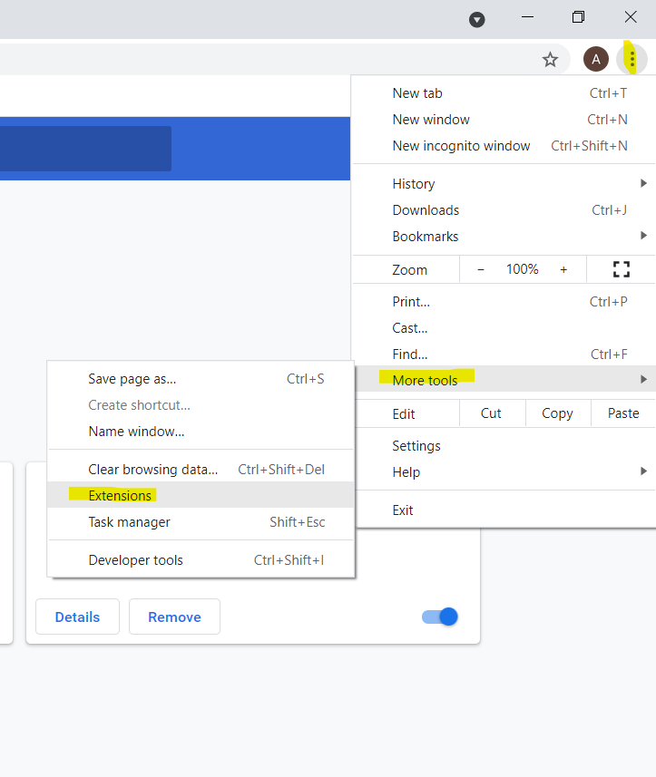
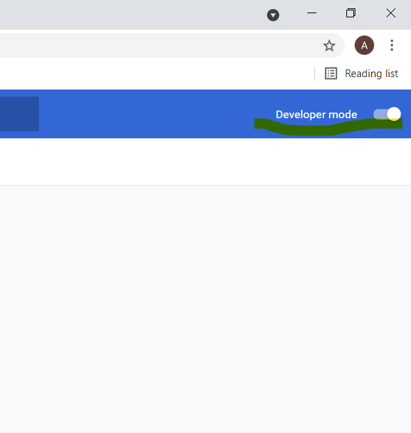
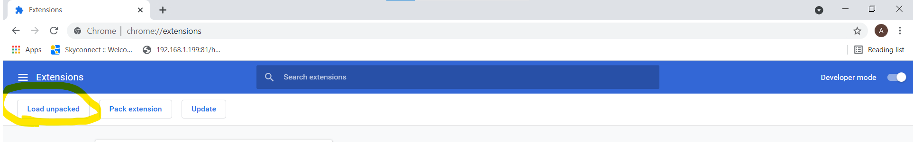

# coding_web
It is a chrome extension which when click shows you list of coding wesites where you can practise your coding skills
# To enable extension on your google chrome 
** Ignore/Delete the Chrome Extension folder and images folder if get cloned to your local computer

**1.**  Fork [this](https://github.com/akshita2903/Coding_Web) repository 

**2** Clone the forked Repository
```
git clone --depth 1 https://github.com/<your_github_username>/Coding_Web.git
```
## If you want to make changes so before making it do the  steps from  3
**3.** Navigate to the project directory :file_folder: .

```
cd Coding_Web
```

**4.** Add a reference(remote) to the original repository.
```
git remote add upstream https://github.com/akshita2903/Coding_Web
```

**5.** Check the remotes for this repository.
```
git remote -v
```
**6.** Always take a pull from the upstream repository to your master branch to keep it at par with the main project(updated repository).

```
git pull upstream master
```
**7.** Now make new branch other than master
```
git checkout -b <your_branch_name>

```
**8.** Make changes

**9** Git push o -u  <your_branch_name>

# Enabling Extension

**1.** Open chrome extension 




**2.** Sign in using your google account.

**3.** Check the Developer Mode <b>OR</b> Switch on the Developer Mode.


**4** Click on unpacked extension.
          

**5.** Upload the folder that contains this forked repository.

Extension has been enabled.
